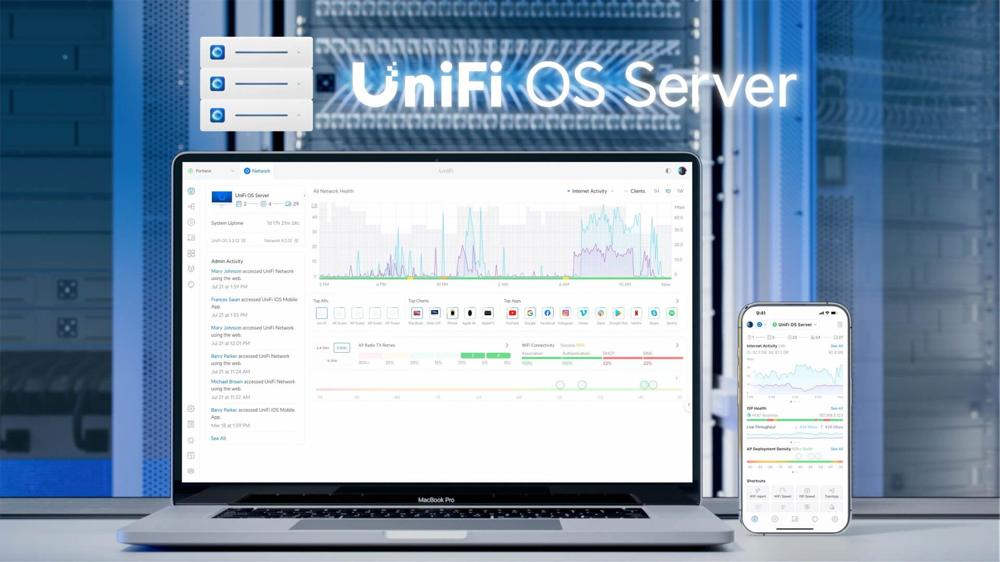

# Home Assistant Community App: UniFi OS Server

[![GitHub Release][releases-shield]][releases]
![Project Stage][project-stage-shield]
[![License][license-shield]](LICENSE.md)

![Supports aarch64 Architecture][aarch64-shield]
![Supports amd64 Architecture][amd64-shield]

[![GitHub Actions][github-actions-shield]][github-actions]
![Project Maintenance][maintenance-shield]
[![GitHub Activity][commits-shield]][commits]

The UniFi OS Server allows you to manage your UniFi network
using a web browser.

## About

This app runs Ubiquiti Networks' UniFi OS Server software, which
allows you to manage your UniFi network via the web browser. The app
provides a single-click installation and run solution for Home Assistant,
allowing users to get their network up, running, and updated, easily.

**Note:** This app now runs UniFi OS Server. This is a major architectural 
change from previous standalone versions and requires elevated privileges 
(Full Access) and a manual data restoration path. 
See the [documentation][docs] for details.

[:books: Read the full app documentation][docs]

## Support

Got questions?

You have several options to get them answered:

- The [Home Assistant Community Apps Discord chat server][discord] for app
  support and feature requests.
- The [Home Assistant Discord chat server][discord-ha] for general Home
  Assistant discussions and questions.
- The Home Assistant [Community Forum][forum].
- Join the [Reddit subreddit][reddit] in [/r/homeassistant][reddit]

You could also [open an issue here][issue] GitHub.

## Contributing

This is an active open-source project. We are always open to people who want to
use the code or contribute to it.

We have set up a separate document containing our
[contribution guidelines](.github/CONTRIBUTING.md).

Thank you for being involved! :heart_eyes:

## Authors & contributors

The original setup of this repository is by [Franck Nijhof][frenck].

For a full list of all authors and contributors,
check [the contributor's page][contributors].

[aarch64-shield]: https://img.shields.io/badge/aarch64-yes-green.svg
[amd64-shield]: https://img.shields.io/badge/amd64-yes-green.svg
[commits-shield]: https://img.shields.io/github/commit-activity/y/hassio-addons/app-unifi.svg
[commits]: https://github.com/hassio-addons/app-unifi/commits/main
[contributors]: https://github.com/hassio-addons/app-unifi/graphs/contributors
[discord-ha]: https://discord.gg/c5DvZ4e
[discord-shield]: https://img.shields.io/discord/478094546522079232.svg
[discord]: https://discord.me/hassioaddons
[docs]: https://github.com/hassio-addons/app-unifi/blob/main/unifi/DOCS.md
[forum-shield]: https://img.shields.io/badge/community-forum-brightgreen.svg
[forum]: https://community.home-assistant.io/t/home-assistant-community-add-on-unifi-controller/56297?u=frenck
[frenck]: https://github.com/frenck
[github-actions-shield]: https://github.com/hassio-addons/app-unifi/workflows/CI/badge.svg
[github-actions]: https://github.com/hassio-addons/app-unifi/actions
[github-sponsors-shield]: https://frenck.dev/wp-content/uploads/2019/12/github_sponsor.png
[github-sponsors]: https://github.com/sponsors/frenck
[issue]: https://github.com/hassio-addons/app-unifi/issues
[license-shield]: https://img.shields.io/github/license/hassio-addons/app-unifi.svg
[maintenance-shield]: https://img.shields.io/maintenance/yes/2026.svg
[patreon-shield]: https://frenck.dev/wp-content/uploads/2019/12/patreon.png
[patreon]: https://www.patreon.com/frenck
[project-stage-shield]: https://img.shields.io/badge/project%20stage-production%20ready-brightgreen.svg
[reddit]: https://reddit.com/r/homeassistant
[releases-shield]: https://img.shields.io/github/release/hassio-addons/app-unifi.svg
[releases]: https://github.com/hassio-addons/app-unifi/releases
[repository]: https://github.com/hassio-addons/repository
